# Trace Integrity for LLM Data Agents

This repository provides reusable artifacts for **Trace Integrity for LLM Data Agents: Auditing Structured-Data Computation Beyond Answer Accuracy in Real-World Systems**. Trace Integrity evaluates whether a structured-data answer is supported by an inspectable computation, alongside conventional measures such as answer accuracy and execution success.

The framework defines seven properties of the recorded computation: explicitness, executability, schema validity, operator fidelity, replayability, answer consistency, and auditability. Execution contracts record the computational commitments that connect a request to an executable program and final answer. The Correct Answer / Invalid Trace (CAIT) Rate summarizes how often correct answers fail the stated trace-integrity checks.

## Workflow

```mermaid
flowchart LR
    A[User request] --> B[Execution contract]
    B --> C[Trace validation]
    C --> D[Query execution]
    D --> E[Reported answer]
    E --> F[Retained trace]
    F --> G[Replay, audit,<br/>regression testing]

    classDef neutral fill:#f8fafc,stroke:#94a3b8,color:#0f172a,stroke-width:1px;
    classDef contract fill:#eef2ff,stroke:#818cf8,color:#1e1b4b,stroke-width:1px;
    classDef check fill:#f0fdf4,stroke:#86efac,color:#14532d,stroke-width:1px;
    classDef run fill:#fff7ed,stroke:#fdba74,color:#7c2d12,stroke-width:1px;
    classDef trace fill:#faf5ff,stroke:#c4b5fd,color:#4c1d95,stroke-width:1px;

    class A,E neutral;
    class B contract;
    class C check;
    class D run;
    class F,G trace;
```



The contract carries the computational commitments that can be checked before execution and reviewed afterward. The retained trace links those commitments to the executable artifact, execution result, and reported answer.

## Quick start

1. Copy [`templates/execution-contract.json`](templates/execution-contract.json) for a new structured-data request.
2. Populate the intent, schema commitments, operator plan, assumptions, execution information, and final-answer linkage.
3. Validate the record structure against [`schemas/execution-contract.schema.json`](schemas/execution-contract.schema.json).
4. Assess the trace with [`evaluation/trace-integrity-checklist.md`](evaluation/trace-integrity-checklist.md).
5. When evaluating a collection of responses, report answer accuracy, execution success, Trace Integrity Pass Rate, and CAIT with the applicable denominators and uncertainty.

## Reuse paths

### Instrument a data agent

Start with [`templates/execution-contract.json`](templates/execution-contract.json) and [`schemas/execution-contract.schema.json`](schemas/execution-contract.schema.json). The record captures intent, schema commitments, operator plan, assumptions, execution information, final-answer linkage, and Trace Integrity assessment. Implementations can extend the schema with local identifiers, data-snapshot metadata, permissions, or tool-call references.

### Evaluate computational support

Use the seven-dimensional checklist in [`evaluation/trace-integrity-checklist.md`](evaluation/trace-integrity-checklist.md) together with [`evaluation/cait.md`](evaluation/cait.md). The checklist supports per-trace review, while the CAIT guidance defines the conditional metric and its reporting requirements. The paper's proof-of-concept uses a narrower experimental operationalization, described in [`SPECIFICATION.md`](SPECIFICATION.md).

### Regression-test a deployed pipeline

Use [`evaluation/regression-testing.md`](evaluation/regression-testing.md) to compare retained traces after changes to schemas, models, system instructions, retrieval context, or execution policy. Stable computational commitments make it possible to detect operator drift even when final answers remain unchanged.

## Repository contents

| Artifact | Purpose |
| --- | --- |
| [`SPECIFICATION.md`](SPECIFICATION.md) | Compact statement of the framework, execution contract, experimental operationalization, and CAIT metric |
| [`terminology.md`](terminology.md) | Definitions used throughout the repository |
| [`schemas/execution-contract.schema.json`](schemas/execution-contract.schema.json) | JSON Schema for execution-contract records |
| [`templates/execution-contract.json`](templates/execution-contract.json) | Blank contract template for new structured-data tasks |
| [`examples/`](examples/) | Worked execution-contract and trace-assessment examples |
| [`evaluation/`](evaluation/) | Trace Integrity checklist, CAIT reporting guidance, and regression-testing procedure |
| [`data/`](data/) | Machine-readable versions of the paper's dimensions and proof-of-concept results |
| [`docs/adoption-guide.md`](docs/adoption-guide.md) | Integration patterns for evaluation and production review |
| [`docs/faq.md`](docs/faq.md) | Common implementation and interpretation questions |

## Core evaluation idea

For a structured-data request, retain the computational commitments that connect the request to the executed program and final answer. A useful record makes the relevant schema elements, filters, joins, grouping, aggregation, ordering, assumptions, executable artifact, and answer linkage available for inspection.

A Trace Integrity assessment considers seven dimensions:

1. **Explicit** — the computational commitments needed to answer the request are recorded.
2. **Executable** — the trace contains a query, program, or structured plan that can be run or deterministically checked.
3. **Schema-valid** — referenced tables, columns, join keys, and fields exist in the available schema.
4. **Operator-faithful** — the recorded operations implement the requested computation.
5. **Replayable** — the computation can be re-executed under the recorded data snapshot and execution environment.
6. **Answer-consistent** — the reported answer follows from the executed trace.
7. **Auditable** — a reviewer or validation system can inspect the computation, assumptions, and failure mode.

The proof-of-concept in the paper scores executability, schema validity, operator fidelity, and answer consistency from generated SQL and retained artifacts. Explicitness is represented by the required structured artifact, while replayability and auditability are properties of the retained evaluation record.

## CAIT

For systems with at least one correct answer,

\[
\mathrm{CAIT}=\frac{N_{\mathrm{correct}\cap\mathrm{invalid}}}{N_{\mathrm{correct}}}.
\]

CAIT is conditional on answer correctness and is reported alongside answer accuracy and trace-level measures. When `N_correct = 0`, CAIT is undefined.

The deterministic checks used in the paper can flag SQL rewrites whose semantic equivalence they cannot establish. Accordingly, the reported CAIT values measure correct answers whose recorded support fails the stated integrity checks. The evaluation guidance records this validator dependence explicitly.

## How to Cite

If you find this work useful in your research, please cite:

```bibtex
@misc{dutta2026traceintegrityllmdata,
      title={Trace Integrity for LLM Data Agents: A Vision for Auditable Structured Reasoning in Real-World Systems}, 
      author={Srimonti Dutta and Akshata Kishore Moharir},
      year={2026},
      eprint={2608.26036},
      archivePrefix={arXiv},
      primaryClass={cs.AI},
      url={https://arxiv.org/abs/2608.26036}, 
}
```

The paper is available on [arXiv](https://arxiv.org/abs/2608.26036).
